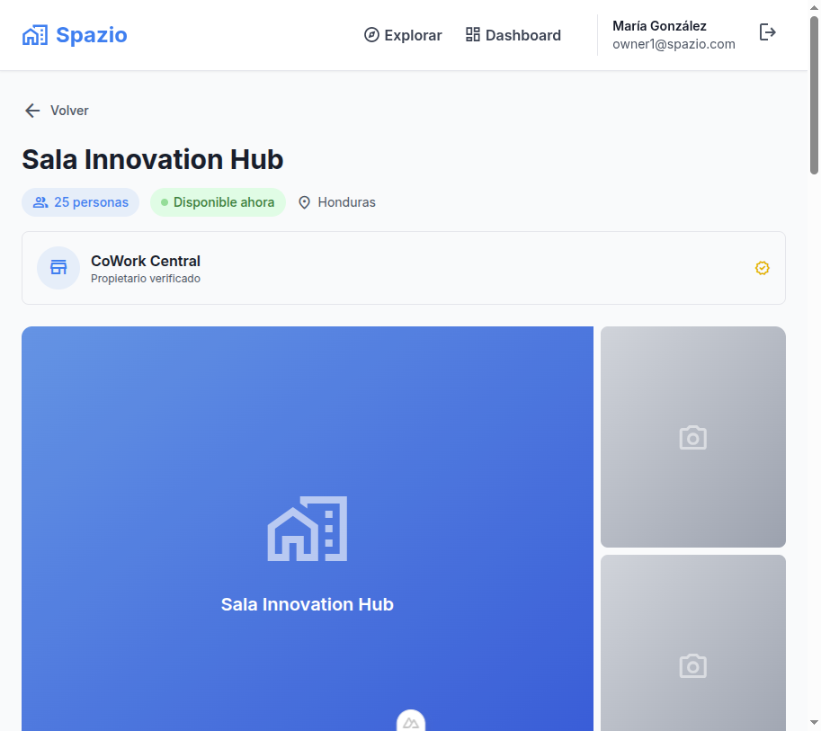
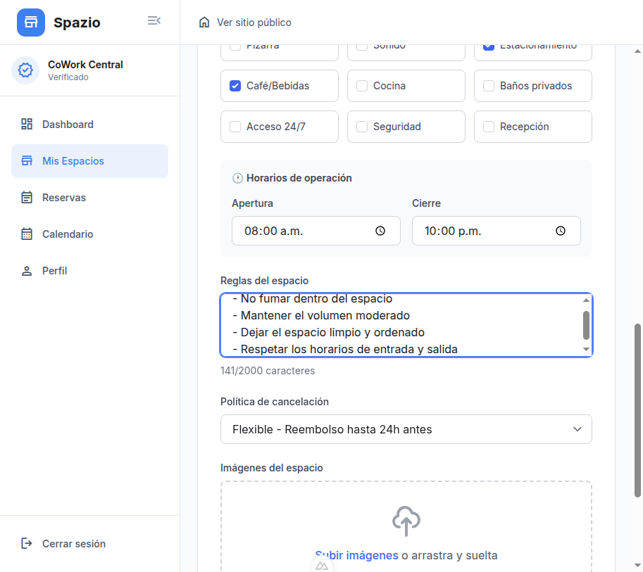
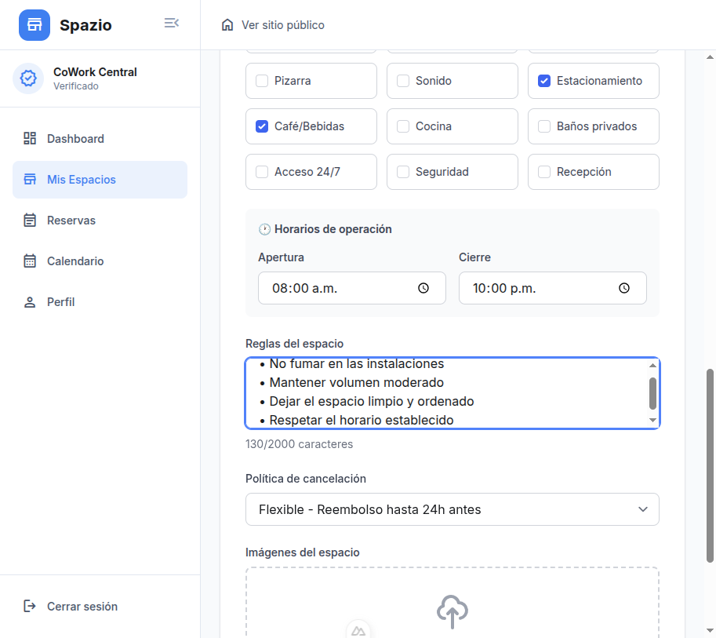

# 🏢 Spazio - Sistema de Reservas Inteligente

<div align="center">

**Plataforma moderna para reservar y gestionar espacios de trabajo y eventos**

[](https://nuxt.com/)
[](https://vuejs.org/)
[](https://nodejs.org/)
[](https://www.typescriptlang.org/)
[](https://www.mongodb.com/)
[](https://www.mysql.com/)

</div>

---

## 📋 Descripción

**Spazio** es una plataforma completa de reservas que conecta a usuarios con espacios de trabajo, salas de reuniones y espacios para eventos. La aplicación permite a los usuarios explorar espacios disponibles, realizar reservas con gestión de pagos simulados, y a los propietarios gestionar sus espacios de manera eficiente.

### ✨ Características Principales

#### Para Usuarios
- 🔍 **Exploración de Espacios** - Navega por diferentes espacios disponibles con filtros avanzados
- 📅 **Sistema de Reservas** - Reserva espacios seleccionando fecha, hora y duración
- 💳 **Gestión de Pagos** - Sistema de pagos simulados con múltiples métodos (efectivo, tarjeta, transferencia)
- 📊 **Dashboard de Reservas** - Visualiza y gestiona todas tus reservas en un solo lugar
- 🔄 **Reprogramación** - Reprograma tus reservas de manera flexible
- ❌ **Cancelación** - Cancela reservas con políticas claras de cancelación

#### Para Propietarios (Owners)
- ➕ **Crear Espacios** - Publica tus espacios con información detallada
- 🖼️ **Gestión de Imágenes** - Sube múltiples imágenes con integración Cloudinary
- ⚙️ **Configuración Avanzada** - Define amenidades, horarios, reglas y políticas de cancelación
- 📈 **Panel de Control** - Visualiza el desempeño de tus espacios
- ✅ **Verificación** - Sistema de verificación para propietarios confiables

#### Características del Sistema
- 🔐 **Autenticación Segura** - Sistema JWT con roles (usuario, propietario, admin)
- 🚫 **Prevención de Double-Booking** - Validación automática de disponibilidad
- 💰 **Cálculo Automático de Precios** - Precios basados en capacidad + tarifa de servicio (8%)
- 🎨 **Diseño Responsivo** - Interfaz moderna adaptada a móvil, tablet y escritorio
- 🌐 **Multi-idioma** - Soporte para español (expandible a más idiomas)

---

## 🖼️ Capturas de Pantalla

### Vista de Detalle de Espacio

*Página de detalle mostrando información completa del espacio, imágenes, amenidades y opciones de reserva*

### Panel de Propietarios - Creación de Espacios

<table>
<tr>
<td width="50%">

<p align="center"><em>Configuración de ubicación y precio</em></p>
</td>
<td width="50%">

<p align="center"><em>Selección de amenidades</em></p>
</td>
</tr>
</table>

### Configuración Completa del Espacio

*Vista completa con amenidades, horarios de operación, reglas del espacio y política de cancelación*

---

## 🏗️ Arquitectura del Sistema

```
Spazio/
├── Backend/              # API REST con Node.js + Express
│   ├── src/
│   │   ├── config/       # Configuración de bases de datos
│   │   ├── entities/     # Modelos de datos (Sequelize + Mongoose)
│   │   ├── use-cases/    # Lógica de negocio
│   │   ├── controllers/  # Controladores de rutas
│   │   ├── routes/       # Definición de endpoints
│   │   └── middleware/   # Autenticación y validación
│   └── package.json
│
├── Web/                  # Frontend con Nuxt.js 4 + Vue 3
│   ├── app/
│   │   ├── components/   # Componentes Vue reutilizables
│   │   ├── composables/  # Lógica reutilizable (Composition API)
│   │   ├── layouts/      # Plantillas de diseño
│   │   ├── pages/        # Páginas (routing automático)
│   │   ├── middleware/   # Middleware de autenticación
│   │   ├── stores/       # Estado global (Pinia)
│   │   ├── services/     # Servicios de API
│   │   └── types/        # Tipos TypeScript
│   └── package.json
│
└── README.md             # Este archivo
```

### Stack Tecnológico

#### Backend
- **Framework:** Express.js
- **Bases de Datos:**
  - MySQL (Sequelize) - Datos relacionales (usuarios, espacios)
  - MongoDB (Mongoose) - Datos flexibles (reservas, logs)
- **Autenticación:** JWT (JSON Web Tokens)
- **Validación:** express-validator
- **Imágenes:** Cloudinary
- **Seguridad:** bcryptjs, CORS

#### Frontend
- **Framework:** Nuxt.js 4 (con Vue 3)
- **Lenguaje:** TypeScript
- **Estilos:** TailwindCSS
- **Estado:** Pinia
- **HTTP:** useFetch (built-in de Nuxt)
- **Iconos:** Material Symbols

---

## 🚀 Configuración e Instalación

### Prerrequisitos

Antes de comenzar, asegúrate de tener instalado:

- **Node.js** v18+ y npm
- **MySQL** v8+
- **MongoDB** v6+
- **(Opcional)** Cuenta de Cloudinary para subida de imágenes

### 1️⃣ Clonar el Repositorio

```bash
git clone https://github.com/enHANSced/Spazio.git
cd Spazio
```

### 2️⃣ Configurar el Backend

```bash
cd Backend

# Instalar dependencias
npm install

# Configurar variables de entorno
cp .env.example .env
# Edita .env con tus credenciales de bases de datos
```

**Variables de entorno requeridas:**
```env
# Servidor
PORT=3001

# MySQL
DB_HOST=localhost
DB_PORT=3306
DB_NAME=spazio_db
DB_USER=root
DB_PASSWORD=tu_password

# MongoDB
MONGODB_URI=mongodb://localhost:27017/spazio

# JWT
JWT_SECRET=tu_secreto_super_seguro

# Cloudinary (opcional)
CLOUDINARY_CLOUD_NAME=tu_cloud_name
CLOUDINARY_API_KEY=tu_api_key
CLOUDINARY_API_SECRET=tu_api_secret
SKIP_CLOUDINARY=false
```

**Crear la base de datos MySQL:**
```sql
CREATE DATABASE spazio_db CHARACTER SET utf8mb4 COLLATE utf8mb4_unicode_ci;
```

**Poblar datos de prueba (opcional):**
```bash
npm run seed
```

Esto creará usuarios de ejemplo:
- **Admin:** `admin@spazio.com` / `admin123`
- **Usuario:** `user@spazio.com` / `user123`
- **Propietario:** `owner1@spazio.com` / `owner123`

**Iniciar el servidor:**
```bash
npm run dev
```

El backend estará disponible en `http://localhost:3001`

### 3️⃣ Configurar el Frontend

En una nueva terminal:

```bash
cd Web

# Instalar dependencias
npm install

# Configurar variables de entorno
cp .env.example .env
# Edita .env si es necesario
```

**Variables de entorno:**
```env
NUXT_PUBLIC_API_BASE_URL=http://localhost:3001/api
NUXT_PUBLIC_APP_NAME=Spazio
NUXT_PUBLIC_APP_VERSION=1.0.0
```

**Iniciar el servidor de desarrollo:**
```bash
npm run dev
```

El frontend estará disponible en `http://localhost:3000`

---

## 📖 Documentación Adicional

- 📘 [Backend API Reference](Backend/API_REFERENCE.md) - Referencia completa de endpoints
- 📗 [Backend README](Backend/README.md) - Documentación detallada del backend
- 📙 [Frontend README](Web/README.md) - Documentación del frontend
- 📕 [Sistema de Reservas](BOOKING_SYSTEM.md) - Implementación del sistema de reservas
- 🧪 [Testing Guide](Backend/TESTING.md) - Guía de pruebas
- ✅ [Validaciones](Backend/VALIDATIONS.md) - Validaciones de inputs

---

## 🎯 Casos de Uso

### Usuario: Reservar un Espacio

1. Explora espacios disponibles desde la página principal
2. Filtra por ubicación, capacidad, precio o amenidades
3. Selecciona un espacio para ver los detalles
4. Elige fecha, hora y duración de la reserva
5. Selecciona método de pago y confirma
6. Recibe confirmación y gestiona desde "Mis Reservas"

### Propietario: Publicar un Espacio

1. Inicia sesión como propietario verificado
2. Accede a "Mis Espacios" desde el dashboard
3. Haz clic en "Crear Nuevo Espacio"
4. Completa información:
   - Nombre y descripción
   - Ubicación completa (dirección, ciudad, departamento)
   - Capacidad y precio por hora
   - Amenidades disponibles
   - Horarios de operación
   - Reglas del espacio
   - Política de cancelación
5. Sube imágenes del espacio
6. Publica y espera aprobación (si aplica)

### Usuario: Gestionar Reservas

1. Accede a "Mis Reservas" desde el menú
2. Visualiza todas tus reservas (próximas y pasadas)
3. Filtra por estado (confirmada, pendiente, cancelada)
4. Haz clic en una reserva para ver detalles
5. Opciones disponibles:
   - **Pagar ahora** (si pago pendiente)
   - **Reprogramar** (crear nueva reserva)
   - **Cancelar** (según política de cancelación)

---

## 💰 Sistema de Precios

Los precios se calculan automáticamente basándose en la capacidad del espacio:

| Capacidad | Precio por Hora |
|-----------|-----------------|
| 1-10 personas | L 300 |
| 11-20 personas | L 500 |
| 21-40 personas | L 800 |
| 41-80 personas | L 1,500 |
| 81+ personas | L 2,500 |

**Tarifa de servicio:** 8% del subtotal

**Ejemplo de cálculo:**
```
Espacio: Sala para 15 personas
Precio base: L 500/hora
Duración: 3 horas
─────────────────────
Subtotal: L 1,500
Tarifa de servicio (8%): L 120
─────────────────────
Total: L 1,620
```

---

## 🔒 Seguridad

### Implementaciones de Seguridad

- ✅ **Contraseñas encriptadas** con bcryptjs
- ✅ **Autenticación JWT** con expiración de tokens
- ✅ **Validación de inputs** en backend con express-validator
- ✅ **CORS configurado** para prevenir accesos no autorizados
- ✅ **Prevención de SQL Injection** usando Sequelize ORM
- ✅ **Prevención de NoSQL Injection** con Mongoose
- ✅ **Validación de roles** para acciones administrativas
- ✅ **Verificación de propietarios** para gestión de espacios

### Buenas Prácticas Implementadas

- Separación de lógica de negocio (use-cases)
- Validación tanto en frontend como backend
- Manejo consistente de errores
- Logs de actividades importantes
- Sanitización de datos de usuario

---

## 🧪 Testing

### Backend

```bash
cd Backend

# Ejecutar tests (cuando estén implementados)
npm test

# Probar endpoints manualmente
# Ver TESTING.md para ejemplos de curl
```

### Frontend

```bash
cd Web

# Verificación de tipos TypeScript
npm run typecheck

# Build de producción (valida el código)
npm run build
```

---

## 📦 Despliegue

### Backend

**Opción 1: Despliegue tradicional**
```bash
cd Backend
npm install --production
npm start
```

**Opción 2: Docker (próximamente)**

### Frontend

**Opción 1: Generación estática**
```bash
cd Web
npm run generate
# Los archivos estáticos estarán en .output/public
```

**Opción 2: Servidor Node**
```bash
cd Web
npm run build
npm run preview
```

**Opción 3: Despliegue en Vercel/Netlify**
- Conecta tu repositorio
- Configura las variables de entorno
- Deploy automático en cada push

---

## 🤝 Contribución

¡Las contribuciones son bienvenidas! Si deseas contribuir:

1. **Fork** el repositorio
2. Crea una **rama** para tu feature (`git checkout -b feature/AmazingFeature`)
3. **Commit** tus cambios (`git commit -m 'Add some AmazingFeature'`)
4. **Push** a la rama (`git push origin feature/AmazingFeature`)
5. Abre un **Pull Request**

### Guías de Contribución

- Sigue las convenciones de código existentes
- Escribe mensajes de commit descriptivos
- Agrega tests para nuevas funcionalidades
- Actualiza la documentación según corresponda
- Asegúrate de que el código pase las validaciones de TypeScript

---

## 🗺️ Roadmap

### 🚧 En Desarrollo

- [ ] Sistema de notificaciones (email y push)
- [ ] Integración con pasarela de pagos real (Stripe/PayPal)
- [ ] Calendario interactivo con disponibilidad en tiempo real
- [ ] Sistema de reseñas y calificaciones
- [ ] Chat en tiempo real entre usuarios y propietarios

### 💡 Futuras Mejoras

- [ ] Aplicación móvil (React Native / Flutter)
- [ ] Sistema de descuentos y promociones
- [ ] Programa de lealtad para usuarios frecuentes
- [ ] Dashboard de analytics para propietarios
- [ ] Integración con Google Calendar
- [ ] Sistema de reportes y estadísticas avanzadas
- [ ] Multi-tenancy para diferentes ciudades/países
- [ ] API pública para integraciones de terceros

---

## 📄 Licencia

Este proyecto está bajo la Licencia MIT. Ver el archivo `LICENSE` para más detalles.

---

## 👥 Equipo

Desarrollado con ❤️ por el equipo de Spazio

---

## 📞 Soporte

¿Tienes preguntas o necesitas ayuda?

- 📧 Email: soporte@spazio.com
- 🐛 Issues: [GitHub Issues](https://github.com/enHANSced/Spazio/issues)
- 📖 Documentación: [Wiki](https://github.com/enHANSced/Spazio/wiki)

---

## 🙏 Agradecimientos

- Gracias a todos los contribuidores del proyecto
- Iconos por [Material Symbols](https://fonts.google.com/icons)
- Inspiración de plataformas como Airbnb y WeWork

---

<div align="center">

**⭐ Si te gusta este proyecto, dale una estrella en GitHub ⭐**

[⬆ Volver arriba](#-spazio---sistema-de-reservas-inteligente)

</div>
